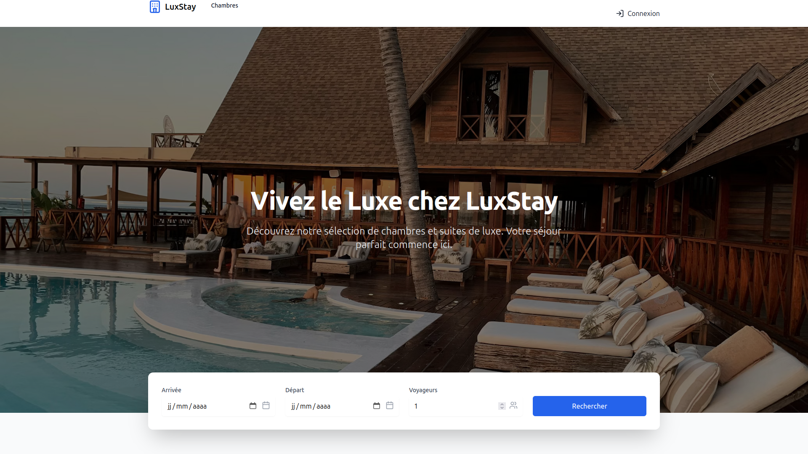

# HOTEL-MANAGEMENT-APP

---

# 📌 Description du projet — Application de Gestion Hôtelière

Ce projet est une **application web moderne de gestion hôtelière**, permettant aux clients de **consulter, filtrer et réserver des chambres**, et aux administrateurs de **gérer les chambres, les réservations, les utilisateurs et les avis**.

L’application offre une **expérience utilisateur fluide et intuitive**, avec un système d’authentification sécurisé, un calendrier de réservation interactif, une galerie d’images, un module d’avis clients et un tableau de bord d’administration.

Développée avec **React, TypeScript, Vite et Tailwind CSS**, et intégrée à **Supabase** pour l’authentification et la base de données, la plateforme garantit **performance, sécurité et évolutivité**.

Elle est conçue pour répondre aux besoins des **hôtels, auberges, résidences et plateformes de location**, en centralisant la gestion des chambres, des clients et des réservations dans une seule interface moderne.

---

```md
# 🏨 HOTEL MANAGEMENT SYSTEM

Application web moderne de **gestion hôtelière**, permettant la réservation de chambres, la gestion des utilisateurs, des avis clients et un tableau de bord administrateur complet.

---

## 🚀 Fonctionnalités

### 👤 Utilisateurs
- Inscription et connexion sécurisées
- Gestion du profil utilisateur
- Consultation des chambres disponibles
- Réservation avec calendrier interactif
- Ajout et consultation d’avis clients

### 🏨 Chambres
- Liste des chambres avec filtres avancés
- Détails complets (images, équipements, prix)
- Galerie d’images et équipements inclus

### 📅 Réservations
- Calendrier de réservation dynamique
- Historique des réservations utilisateur
- Gestion des réservations côté admin

### 🛠️ Administration
- Tableau de bord administrateur
- Gestion des chambres
- Gestion des réservations
- Suivi des utilisateurs
- Supervision des avis clients

---

## 🛠️ Technologies utilisées

- **React + TypeScript**
- **Vite** — Build rapide
- **Tailwind CSS** — UI moderne
- **Supabase** — Authentification & Base de données
- **PostCSS**
- **Lucide Icons**
- **React Router**

---

## 📂 Structure du projet

```

src/
├── components/       # Composants UI
├── pages/            # Pages principales
├── lib/              # Supabase & Auth
├── App.tsx           # Entrée principale
├── main.tsx          # Bootstrap React
├── index.css         # Styles globaux
supabase/
└── migrations/       # Scripts SQL

````

---

## 🧩 Principaux composants

| Composant | Rôle |
|----------|------|
| `RoomCard` | Carte d’affichage des chambres |
| `RoomFilters` | Filtres de recherche |
| `BookingCalendar` | Calendrier des réservations |
| `BookingsList` | Liste des réservations |
| `ReviewsList` | Avis clients |
| `AdminDashboard` | Dashboard Admin |
| `AuthProvider` | Authentification |

---

## 🖼️ Captures d’écran (optionnel)

```md


````

---

## ⚙️ Installation & Lancement

### 1️⃣ Cloner le projet

```bash
git clone https://github.com/Adam01-i/HOTEL-MANAGEMENT-APP.git 
cd HOTEL-MANAGEMENT-APP
```

### 2️⃣ Installer les dépendances

```bash
npm install
```

### 3️⃣ Configurer Supabase

Créer un fichier `.env` :

```env
VITE_SUPABASE_URL=your_url_here
VITE_SUPABASE_ANON_KEY=your_key_here
```

### 4️⃣ Lancer le projet

```bash
npm run dev
```

➡️ Accès : [http://localhost:5173](http://localhost:5173)

---

## 🗄️ Base de données (Supabase)

Tables principales :

* `users`
* `rooms`
* `bookings`
* `reviews`

Migrations disponibles dans :

```
supabase/migrations/
```

---

## 🔐 Sécurité

* Authentification Supabase
* Protection des routes Admin
* Validation des formulaires
* Gestion des rôles (User / Admin)

---

## 🚀 Déploiement

Plateformes recommandées :

* **Vercel**
* **Netlify**
* **Cloudflare Pages**

```bash
npm run build
```

---

## 📧 Contact

**Auteur : Adama Seck**
📩 Email : [seckmote@gmail.com](mailto:seckmote@gmail.com)
💼 GitHub : [https://github.com/Adam01-i](https://github.com/Adam01-i)
🔗 LinkedIn : [https://linkedin.com/in/Adam01-i](https://linkedin.com/in/Adam01-i)

---

## 📄 Licence

Projet sous licence **MIT**.

```
